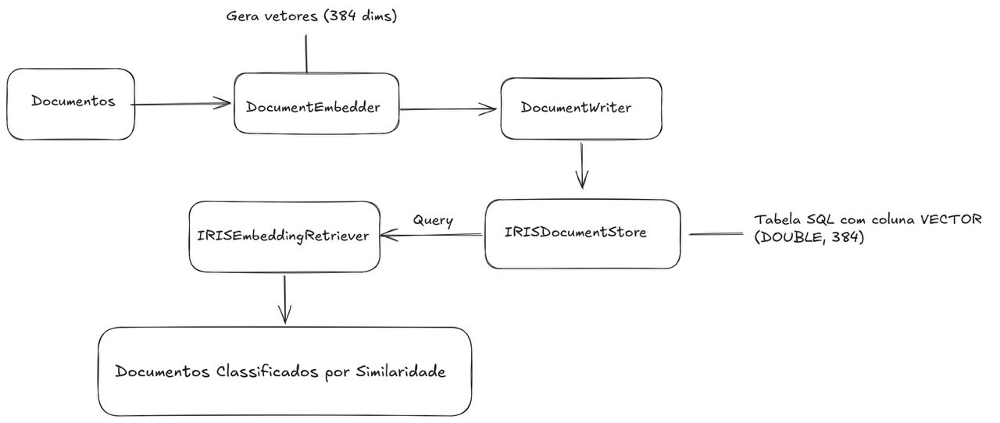

# IRIS DocumentStore para Haystack

DocumentStore customizado que integra o **InterSystems IRIS** ao framework **Haystack**, habilitando busca semântica vetorial (RAG) com suporte nativo a `VECTOR_COSINE` do IRIS.

---

## Índice

- [Sobre o Projeto](#sobre-o-projeto)
- [Tecnologias](#tecnologias)
- [Pré-requisitos](#pré-requisitos)
- [Configuração e Execução](#configuração-e-execução)
- [Estrutura do Projeto](#estrutura-do-projeto)
- [Como Funciona](#como-funciona)
- [API do DocumentStore](#api-do-documentstore)

---

## Sobre o Projeto

Este projeto implementa um `DocumentStore` personalizado para o **Haystack** que usa o **InterSystems IRIS** como banco de dados vetorial. O IRIS suporta nativamente colunas do tipo `VECTOR` e funções como `VECTOR_COSINE` e `TO_VECTOR`, tornando-o adequado para aplicações de Recuperação Aumentada com Geração (RAG).

### O que é Haystack?
[Haystack](https://haystack.deepset.ai/) é um framework open-source para construir pipelines com LLMs. O `DocumentStore` é o componente responsável por armazenar e recuperar documentos.

### O que é InterSystems IRIS?
[IRIS](https://www.intersystems.com/products/intersystems-iris/) é um banco de dados multimodelo de alta performance que suporta SQL, JSON, vetores e outros paradigmas em uma única plataforma.

---

## Tecnologias

| Tecnologia | Versão | Papel |
|---|---|---|
| Python | 3.10+ | Linguagem principal |
| Haystack | 2.x | Framework de pipelines LLM |
| InterSystems IRIS | Community Edition | Banco de dados vetorial |
| intersystems-irispython | 5.3+ | Driver DB-API oficial |
| sentence-transformers | 3.x | Geração de embeddings locais |
| Docker | 20+ | Container do IRIS |

---

## Pré-requisitos

- Python 3.10 ou superior
- Docker
- Git

---

## Configuração e Execução

### 1. Clone o repositório

```bash
git clone https://github.com/<seu-usuario>/iris-haystack-documentstore.git
cd iris-haystack-documentstore
```

### 2. Crie o ambiente virtual e instale as dependências

```bash
python -m venv .venv

# Linux / macOS
source .venv/bin/activate

# Windows
.venv\Scripts\activate

pip install -r requirements.txt
```

### 3. Configure as variáveis de ambiente

```bash
cp .env.example .env
```

Edite o `.env` com suas credenciais (as padrão já funcionam com o Docker):

```env
IRIS_HOST=localhost
IRIS_PORT=1972
IRIS_NAMESPACE=USER
IRIS_USERNAME=_system
IRIS_PASSWORD=SYS
```

### 4. Suba o IRIS com Docker

```bash
docker-compose up -d
```

Aguarde cerca de 30 segundos para o IRIS inicializar.  
Você pode verificar o status com:

```bash
docker-compose logs -f iris
```

O **Management Portal** (interface web do IRIS) estará disponível em:  
📌 `http://localhost:52773/csp/sys/UtilHome.csp`  
Usuário: `_system` | Senha: `SYS`

### 5. Execute o exemplo completo

```bash
cd src
python example_pipeline.py
```

Você verá a indexação de 5 documentos e 3 buscas semânticas com os resultados ordenados por similaridade.

**Saída esperada:**
```
DocumentStore: IRISDocumentStore(host=localhost, port=1972, ...)
Total de documentos antes da indexação: 0
Indexando documentos...
Total após indexação: 5 documentos

🔍 Consulta: 'como funciona busca por similaridade?'
  1. [0.8923] Busca vetorial permite encontrar documentos semanticamente...
  2. [0.7541] Haystack é um framework open-source para construir...
  ...
```

---

## Estrutura do Projeto

```
iris-haystack-documentstore/
│
├── docker-compose.yml          # IRIS Community Edition via Docker
├── requirements.txt            # Dependências Python
├── .env.example                # Template de variáveis de ambiente
├── .gitignore
├── README.md
│
├── src/
│   ├── iris_document_store.py  # DocumentStore principal (Haystack 2.x)
│   ├── iris_retriever.py       # Retriever semântico customizado
│   └── example_pipeline.py    # Demonstração: indexação + busca
│
└── tests/
    └── test_document_store.py  # Testes unitários com pytest
```

---

## Como Funciona

### Arquitetura



### Fluxo de Indexação

1. O `SentenceTransformersDocumentEmbedder` transforma cada documento em um vetor de 384 dimensões.
2. O `DocumentWriter` chama `write_documents()` no `IRISDocumentStore`.
3. O vetor é convertido para string no formato `[0.1,0.2,...]` e inserido com `TO_VECTOR(?, DOUBLE)`.

### Fluxo de Busca

1. O `SentenceTransformersTextEmbedder` converte a query em vetor.
2. O `IRISEmbeddingRetriever` chama `embedding_retrieval()`.
3. O IRIS executa `VECTOR_COSINE(embedding, TO_VECTOR(query, DOUBLE))` e retorna os N mais similares.

---

## API do DocumentStore

### Métodos principais

| Método | Descrição |
|---|---|
| `count_documents()` | Retorna o total de documentos |
| `filter_documents(filters)` | Filtra por campos de metadados |
| `write_documents(docs, policy)` | Grava documentos (FAIL/SKIP/OVERWRITE) |
| `delete_documents(ids)` | Remove documentos por ID |
| `embedding_retrieval(query, top_k)` | Busca vetorial por similaridade |

### Exemplo de código

```python
from iris_document_store import IRISDocumentStore
from haystack import Document
from haystack.document_stores.types import DuplicatePolicy

store = IRISDocumentStore(host="localhost", port=1972)

# Gravar
store.write_documents([
    Document(content="Exemplo de documento", meta={"fonte": "manual"})
])

# Filtrar por metadados
docs = store.filter_documents(filters={"fonte": "manual"})

# Deletar
store.delete_documents([doc.id for doc in docs])git checkout -b minha-nova-branch
```

---

## Referências

- [Documentação Haystack — Custom DocumentStore](https://docs.haystack.deepset.ai/docs/creating-custom-document-stores)
- [InterSystems IRIS Python DB-API](https://docs.intersystems.com/iris20261/csp/docbook/Doc.View.cls?KEY=BPYDBAPI_about)
- [IRIS Vector Search](https://docs.intersystems.com/irislatest/csp/docbook/DocBook.UI.Page.cls?KEY=GSQL_vecsearch)
- [intersystems-irispython no PyPI](https://pypi.org/project/intersystems-irispython/)