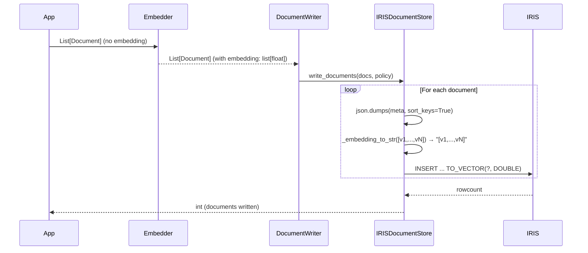
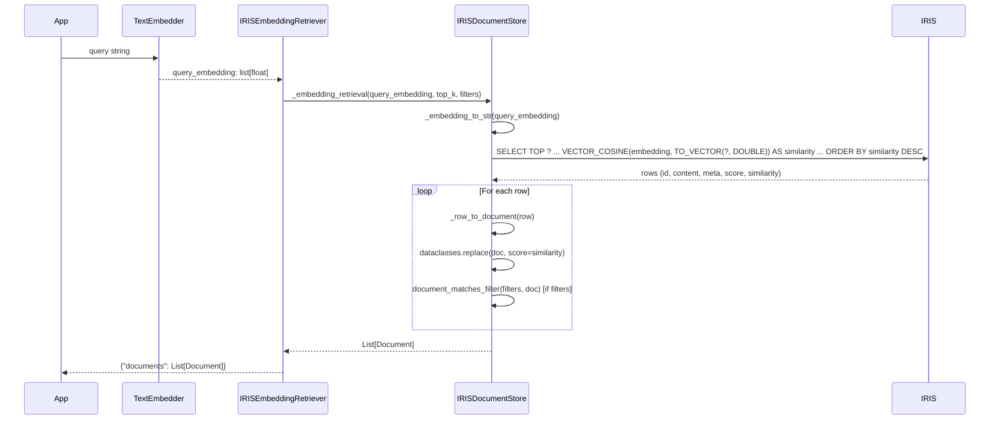

# Architecture

This page explains the internal design of `iris-haystack`: how components are organized, why certain decisions were made, and how data flows through the system.

---

## Component map

```
iris-haystack/
└── src/haystack_integrations/
    ├── document_stores/
    │   └── iris/
    │       ├── __init__.py          ← public re-exports
    │       └── document_store.py   ← IRISDocumentStore + _BM25Index
    └── components/
        └── retrievers/
            └── iris/
                ├── __init__.py           ← public re-exports
                ├── embedding_retriever.py
                └── bm25_retriever.py
```

The `haystack_integrations` namespace is **shared** across all Haystack integrations. Any integration installed in the same virtualenv contributes its modules under this namespace — it is a [PEP 420 implicit namespace package](https://peps.python.org/pep-0420/).

---

## Data flow

### Indexing



### Semantic retrieval



---

## Key design decisions

### 1. `document_matches_filter` for all filtering

The filtering logic uses Haystack's official `document_matches_filter` utility instead of a custom implementation:

```python
from haystack.utils.filters import document_matches_filter

return [d for d in docs if document_matches_filter(filters, d)]
```

**Why:** This is the same function used by `InMemoryDocumentStore`. Using it guarantees:

- Identical filter behaviour across all Haystack DocumentStores
- All `FilterDocumentsTest` mix-in cases pass without custom logic
- Future Haystack filter improvements are inherited for free

**Trade-off:** All documents are loaded from IRIS into Python before filtering. For write-heavy, read-light workloads on small collections this is fine. For large collections with simple filters, a SQL `WHERE` clause would be more efficient.

### 2. `sort_keys=True` in meta serialization

```python
meta_str = json.dumps(doc.meta or {}, ensure_ascii=False, sort_keys=True)
```

**Why:** The `meta` column stores JSON as a string. `sort_keys=True` ensures that `{"b": 1, "a": 2}` and `{"a": 2, "b": 1}` produce the same string, which:

- Makes document IDs deterministic (Haystack uses content hash for IDs)
- Enables reliable LIKE-pattern matching as a fast pre-filter
- Avoids surprises when the same dict is serialized in different insertion orders

### 3. `dataclasses.replace()` for score assignment

```python
doc = dataclasses.replace(doc, score=similarity)
```

**Why:** `Document` is a `dataclass` in Haystack 2.x. In a pipeline, the same `Document` object may be referenced by multiple components. Mutating `doc.score = value` in place generates a Haystack warning and can cause subtle bugs where one component's change affects another's view of the document. `dataclasses.replace` creates a new instance, preserving the original.

### 4. Haystack `Secret` for credentials

```python
def __init__(
    self,
    *,
    connection_string: Secret = Secret.from_env_var("IRIS_CONNECTION_STRING"),
    username: Secret = Secret.from_env_var("IRIS_USERNAME"),
    password: Secret = Secret.from_env_var("IRIS_PASSWORD"),
    ...
```

**Why:**

- `Secret` values are never included in `to_dict()` output, preventing credential leakage in serialized YAML pipelines
- `Secret.from_env_var` defers resolution to runtime, not import time
- Follows the same pattern as `MongoDBAtlasDocumentStore`, `PgvectorDocumentStore`, and other official integrations

### 5. Automatic reconnection with `_ensure_connection`

```python
def _ensure_connection(self) -> None:
    try:
        cur = self._conn.cursor()
        cur.execute("SELECT 1")
        cur.close()
    except Exception:
        logger.warning("IRIS connection lost — reconnecting...")
        self._connect_with_retry()
```

**Why:** IRIS can close idle connections after a configurable timeout. Long-running applications (e.g., a web server with an infrequently used DocumentStore) would crash with a stale connection. The lightweight `SELECT 1` ping adds negligible overhead while making the store resilient to network interruptions and IRIS restarts.

### 6. BM25 index rebuilt on every call

```python
def _bm25_retrieval(self, query, *, filters=None, top_k=10):
    candidates = self.filter_documents(filters=filters)
    self._bm25.build([(d.id, d.content or "") for d in candidates])
    ...
```

**Why:** The BM25 index must always reflect the current state of the document store. Since there is no write hook to invalidate a cached index, rebuilding on demand is the simplest correct approach.

**Trade-off:** For large collections, this adds latency. Contributors can improve this with an event-based invalidation strategy (hooking into `write_documents` and `delete_documents`).

---

## Table schema

```sql
CREATE TABLE IF NOT EXISTS SQLUser.HaystackDocuments (
    id        VARCHAR(128)  NOT NULL PRIMARY KEY,   -- Haystack-generated hash
    content   LONGVARCHAR,                           -- document text
    meta      LONGVARCHAR,                           -- json.dumps(sort_keys=True)
    score     DOUBLE,                                -- source score if available
    embedding VECTOR(DOUBLE, 384)                    -- embedding_dim configurable
)
```

### Why `SQLUser` schema?

IRIS requires a schema prefix. `SQLUser` is the default namespace schema for user-defined tables in the `USER` namespace and does not require additional permissions to create tables in it.

### Why `LONGVARCHAR` for content and meta?

`LONGVARCHAR` is IRIS's variable-length text type without an upper size limit. Documents can be arbitrarily long and metadata can contain many keys — using a fixed-size `VARCHAR(N)` would silently truncate large documents.
